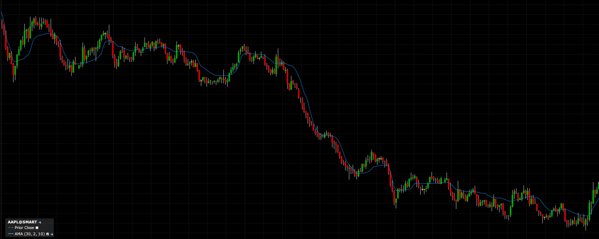
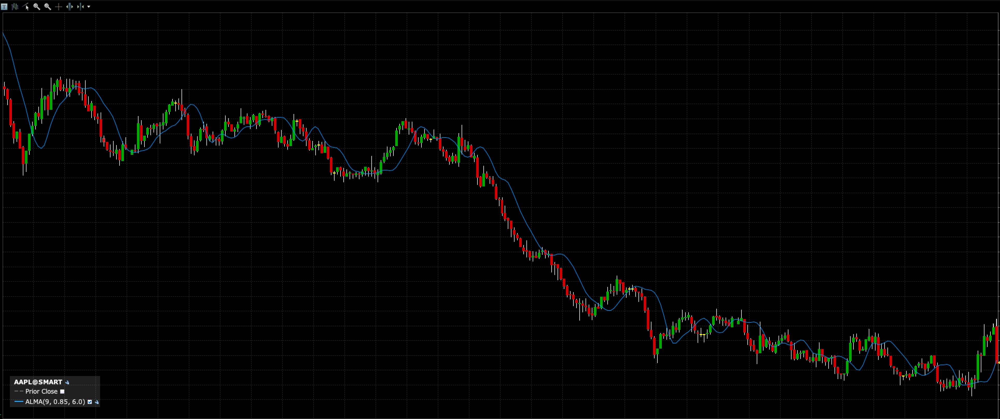
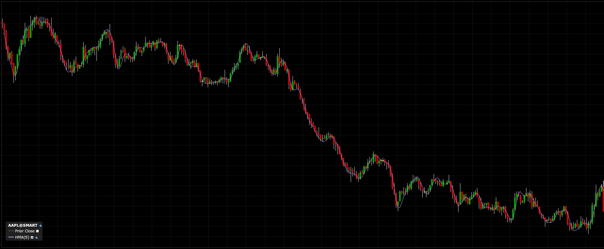
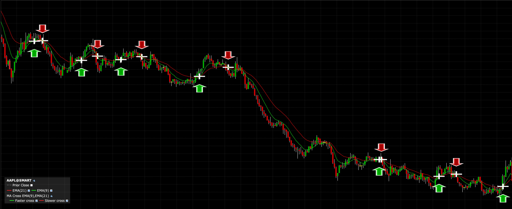

# Moving Average / Momentum Indicators References (Interactive Brokers)

## Adaptive Moving Average

* IBKR reference: [Adaptive Moving Average](https://www.interactivebrokers.com/campus/glossary-terms/adaptive-moving-average/)
* Notes:
  * Direct IBKR glossary entry
  * Adaptive moving average indicator reference in IBKR Campus
* Parameters:
  * Source: Trades
  * Input Price: Close
  * Slow smoothing period: 9
  * Fast smoothing period: 2
  * AMA period: 10
  * Period: 9

* Observation Notes:
  * Lagging a bit. 
  * @todo: wonder if the derivative is a direction indicator. 
  

---

## Arnaud Legoux Moving Average

* IBKR reference: [Arnaud Legoux Moving Average](https://www.interactivebrokers.com/campus/glossary-terms/arnaud-legoux-moving-average/)
* Notes:
  * Direct IBKR glossary entry
  * Often abbreviated as ALMA
* Parameters:
  * Source: Trades
  * Input Price: Close
  * Period: 9
  * Offset: 0.85
  * Sigma: 6.0

* Observation Notes:
  * if price below line, sell & vice versa. 
  * @todo: looks good, model test! 
  * 

---

## Bollinger Band Width

* IBKR reference: [Bollinger Bands Width Indicator](https://www.interactivebrokers.com/campus/glossary-terms/bollinger-bands-width-indicator/)
* Notes:
  * IBKR uses the title “Bollinger Bands Width Indicator”
  * Related to Bollinger Bands

---

## Bollinger Bands

* IBKR reference: [Bollinger Bands](https://www.interactivebrokers.com/campus/glossary-terms/bollinger-bands/)
* Notes:
  * Direct IBKR glossary entry
  * Standard volatility-band reference in IBKR Campus

---

## Departure Chart

* IBKR reference: [Departure Chart](https://www.interactivebrokers.com/campus/glossary-terms/departure-chart/)
* Notes:
  * Direct IBKR glossary entry

---

## Double Exponential Moving Average

* IBKR reference: [Double Exponential Moving Average (DEMA)](https://www.interactivebrokers.com/campus/glossary-terms/double-exponential-moving-average-dema/)
* Notes:
  * IBKR uses the title with “DEMA”

---

## Ease of Movement

* IBKR reference: [Ease of Movement Indicator](https://www.interactivebrokers.com/campus/glossary-terms/ease-of-movement-indicator/)
* Notes:
  * IBKR uses the title “Ease of Movement Indicator”

---

## Exponential Moving Average

* IBKR reference: [Exponential Moving Average](https://www.interactivebrokers.com/campus/glossary-terms/exponential-moving-average/)
* Notes:
  * Direct IBKR glossary entry

---

## Hull Moving Average

* IBKR reference: [Hull Moving Average](https://www.interactivebrokers.com/campus/glossary-terms/hull-moving-average/)
* Parameters:
  * Source: Trades
  * Input Price: Close
  * Period: 9

* Observation Notes:
  * Lagging by 1 period; 
  * current value is a reflection of last period
  
  
---

## Know Sure Thing

* IBKR reference: [Know Sure Thing (KST)](https://www.interactivebrokers.com/campus/glossary-terms/know-sure-thing-kst/)
* Notes:
  * IBKR uses the title “Know Sure Thing (KST)”

---

## MA Crossover

* IBKR reference: [Chart Indicators - Documentation](https://guides.interactivebrokers.com/tws/usersguidebook/technicalanalytics/demarkpivotpoints.htm?TocPath=Technical+Analytics%7CChart+Indicators%7C_____19)
* Notes:
  * Found in IBKR TWS chart-indicator documentation
  * IBKR description includes bullish and bearish crossover behavior
* Parameters:
  * Source: Trades
  * First Base Average: EMA
  * Period of Fast Average: 9
  * Second Base Average: EMA
  * Period of slow Average: 21
  
* Observation Notes:
  * Indicators seem to be pretty right on 
  
  

---

## McGinley Dynamic

* IBKR reference: [McGinley Dynamic](https://www.interactivebrokers.com/campus/glossary-terms/mcginley-dynamic/)
* Notes:
  * Direct IBKR glossary entry

---

## Moving Standard Deviation

* IBKR reference: [Moving Standard Deviation](https://www.interactivebrokers.com/campus/glossary-terms/moving-standard-deviation/)
* Notes:
  * Direct IBKR glossary entry

---

## Percent B

* IBKR reference: [Percent B Indicator](https://www.interactivebrokers.com/campus/glossary-terms/percent-b-indicator/)
* Notes:
  * IBKR uses the title “Percent B Indicator”
  * Related to Bollinger Bands

---

## Simple Moving Average

* IBKR reference: [Simple Moving Average](https://www.interactivebrokers.com/campus/glossary-terms/simple-moving-average/)
* Notes:
  * Direct IBKR glossary entry

---

## TRIX

* IBKR reference: [TRIX Indicator](https://www.interactivebrokers.com/campus/glossary-terms/trix-indicator/)
* Notes:
  * IBKR uses the title “TRIX Indicator”

---

## Triangular Moving Average

* IBKR reference: [Triangular Moving Average (TMA)](https://www.interactivebrokers.com/campus/glossary-terms/triangular-moving-average-tma/)
* Notes:
  * IBKR uses the title with “TMA”

---

## Triple Exponential Moving Average

* IBKR reference: [Triple Exponential Moving Average (TEMA)](https://www.interactivebrokers.com/campus/glossary-terms/triple-exponential-moving-average-tema/)
* Notes:
  * IBKR uses the title with “TEMA”

---

## Ultimate Oscillator

* IBKR reference: [Ultimate Oscillator](https://www.interactivebrokers.com/campus/glossary-terms/ultimate-oscillator/)
* Notes:
  * Direct IBKR glossary entry

---

## Variable Moving Average

* IBKR reference: [Variable Moving Average](https://www.interactivebrokers.com/campus/glossary-terms/variable-moving-average/)
* Notes:
  * Direct IBKR glossary entry

---

## Weighted Moving Average

* IBKR reference: [Weighted Moving Average](https://www.interactivebrokers.com/campus/glossary-terms/weighted-moving-average/)
* Notes:
  * Direct IBKR glossary entry

---

## Wilder Moving Average

* IBKR reference: [Wilder’s Moving Average](https://www.interactivebrokers.com/campus/glossary-terms/wilders-moving-average/)
* Notes:
  * IBKR uses the title “Wilder’s Moving Average”

---

## General Reference

* IBKR chart indicator library overview: [Chart Indicators | IBKR Glossary](https://www.interactivebrokers.com/campus/glossary-terms/chart-indicators/)
* Notes:
  * Useful umbrella page for IBKR’s technical indicator glossary
  * Good top-level reference for the platform’s indicator library